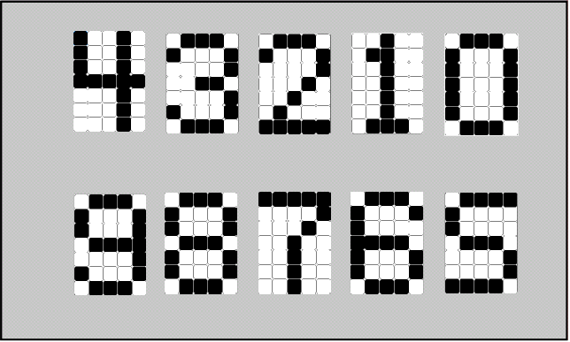



# Arabic Numerals Identification using Neural Networks
on 5x7 grid

**By:** 

**Mohamed Adel Iraqi Bakery**	

# Contents
[Introduction:	4](#_toc155290210)

[Project Description:	5](#_toc155290211)

[Project Steps:	6](#_toc155290212)

[Data Sets:	6](#_toc155290213)

[Creating the Neural Network:	6](#_toc155290214)

[Output:	7](#_toc155290215)

[Building the GUI:	8](#_toc155290216)

[Test Cases:	9](#_toc155290217)

[User Inputs 1:	9](#_toc155290218)

[Users Inputs 8:	9](#_toc155290219)

[User Inputs 8 with an error:	10](#_toc155290220)

[Installation Guide	10](#_toc155290221)

[1.	Install MATLAB2023B or newer (works with MATLAB online too)	10](#_toc155290222)

[2.	Run the “Arabic_numbers_gui.mlappinstall” in matlab	10](#_toc155290223)

[References:	11](#_toc155290224)

Table of Figures

[Figure 1: Neural Network Diagram	3](#_toc155147693)

[Figure 2: Arabic Numbers	4](#_toc155147694)

[Figure 3: 2 variations of our Dataset	5](#_toc155147695)

[Figure 4: Layers of one network	6](#_toc155147696)

[Figure 5: Feed-Forward Neural Network	6](#_toc155147697)

[Figure 6: Output of Our Neural Network	6](#_toc155147698)

[Figure 7: GUI	7](#_toc155147699)

[Figure 8: First Test Case	8](#_toc155147700)

[Figure 9: Second Test Case	8](#_toc155147701)

[Figure 10: Third Test Case	9](#_toc155147702)

# Introduction:
A neural network is a computational model inspired by the structure and functioning of the human brain. It is a key component of machine learning, a broader field of artificial intelligence (AI). Neural networks are designed to recognize patterns, make decisions, and learn from data. At its core, a neural network consists of interconnected nodes, also known as neurons or artificial neurons, organized into layers. These layers are typically categorized into three types: input layer, hidden layers, and output layer. The input layer receives the initial data, the hidden layers process this information through weighted connections, and the output layer produces the result. The strength of neural networks lies in their ability to learn from data through a training process. During training, the network adjusts its internal parameters, known as weights and biases, to minimize the difference between its predictions and the actual outcomes in each dataset. This process, known as backpropagation, involves iteratively refining the network's parameters to improve its performance.

Neural networks can be applied to various tasks, including image and speech recognition, natural language processing, and decision-making. They excel in tasks where traditional rule-based programming may be challenging or impractical due to the complexity and variability of the input data. Deep learning, a subset of machine learning, leverages neural networks with multiple hidden layers, often referred to as deep neural networks. Deep learning has achieved remarkable success in various domains, leading to breakthroughs in areas such as computer vision, speech recognition, and natural language understanding.

In summary, neural networks are powerful computational models that mimic the structure and function of the human brain, enabling machines to learn and make decisions from data. Their versatility and ability to adapt to complex patterns make them a fundamental technology in the field of artificial intelligence.

**Figure 1: Neural Network Diagram**
# Project Description:
To use Fuzzy Logic system to recognize Arabic numerals and build a GUI to demonstrate how our system works.

**Figure 2: Arabic Numbers**

` `We will use the toolbox of neural network which is built inside the MATLAB, and MATLAB GUI to implement our project.

# Project Steps:
## **Data Sets:**
\- For the first part of our project we must create our dataset that our neural network will use to train and test, and those data sets will be our input layer.

\- We created 30 variations for each number so in total 300 variations, and then we added noise to each variation so we could increase the diversity of the dataset and improve the model's generalization.

\- Our variations are all 5\*7 matrix, so 35 input victors as following example:

**Figure 3: 2 variations of our Dataset**
## **Creating the Neural Network:**
\- After getting the data sets as our input, we must build our neural network to train on those data sets.

\- After a lot of testing on how we can get the best validation, we choose to build nine networks which are all feed-forward for pattern recognition with different number of layers and neurons, but our layers are mostly linear with the last layer being non-linear to increase the accuracy of our system.

\- We use resilient back propagation training technique as it is the best training method that outputted the best results as the average validation was around 97 % with this training method.

\- We used maximum number of validation checks = 1000 to avoid over fitting as much as possible, and number of epochs = 100000. 

**Figure 4: Layers of one network**

In the previous network we used 2 layers (1 hidden layers), The hidden layer contains 65 neurons use SoftMax transfer functions, which is best for classification tasks, while the output layer is non-linear Symmetric sigmoid transfer function to get better accuracy.

After the training of the 9 networks, we take a majority vote for the final output, we gave the network with the best output more than one vote to increase its weight in the votes.

**Figure 5: Feed-Forward Neural Network**
## **Output:**

**Figure 6: Output of Our Neural Network**

## **Building the GUI:**
Our main reason of using a GUI, so that the user could enter the input easily and doesn’t have to enter the number bit by bit, so the user could simply click the boxes to get the number he wants, and the GUI will automatically output the number on the screen.

**Figure 7: GUI**

## **Test Cases:**
### **User Inputs 1:**

**Figure 8: First Test Case**
### **Users Inputs 8:**

**Figure 9: Second Test Case**
### **User Inputs 8 with an error:**

**Figure 10: Third Test Case**
# Installation Guide
1. # Install MATLAB2023B or newer (works with MATLAB online too)
1. # Run the “Arabic\_numbers\_gui.mlappinstall” in matlab
# References:
*Body fat Estimation - MATLAB & Simulink*. (n.d.). https://www.mathworks.com/help/releases/R2023b/deeplearning/ug/body-fat-estimation.html
